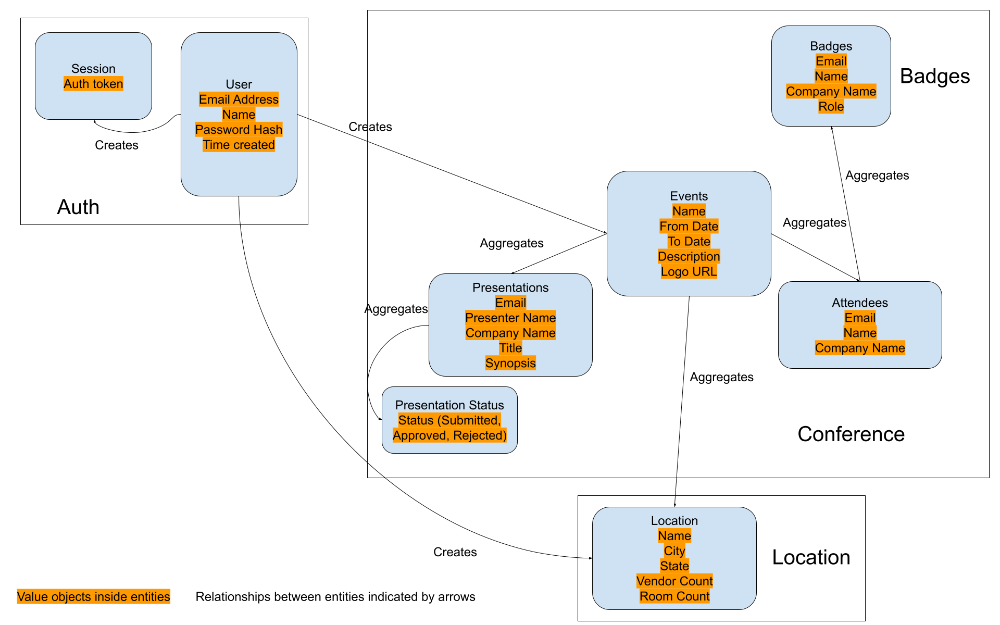

# Conference GO!: A Professional Development Application

This is an application composed of microservices that uses a traditional frontend/backend
architecture providing conference management functionality. To run it locally,
please read the instructions in each project's README files.

- [Frontend README](./frontend/README.md)
- [Conference README](./conference/README.md)

## Domain diagram

